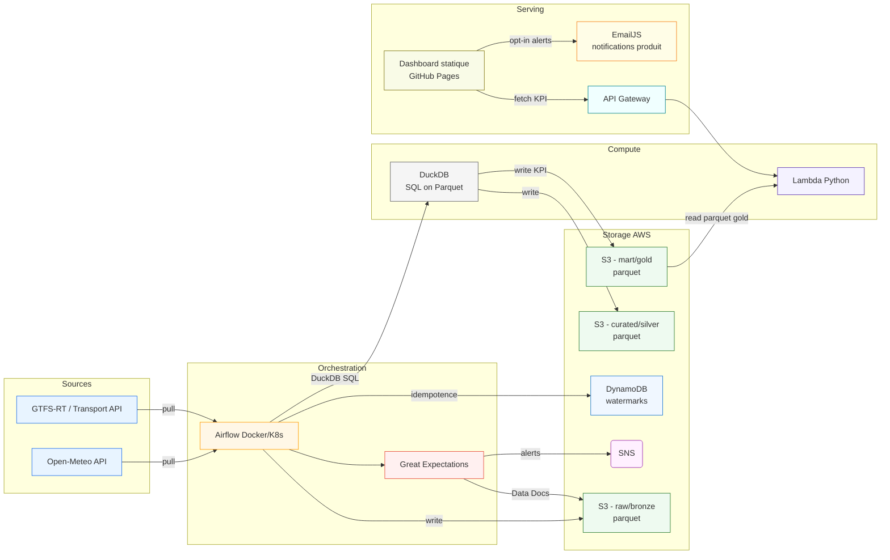

# Dataops Urban Mobility & Weather Insights Platerform

> **Plateforme data “end-to-end”** corrélant météo et ponctualité des transports urbains.
> Stack : **Airflow**, **Great Expectations**, **AWS** (S3, DynamoDB, SNS, API GW, Lambda), **DuckDB**, **Terraform**, **GitHub Actions**, **GitHub Pages**.


----------------------------------------------------------------------------------------------------------

## 1) Etapes Clés 

* Ingestion continue (météo + transport) → **S3** (bronze)
* **Validation data** (Great Expectations) + **alertes SNS**
* Curations et **KPI** via **DuckDB** → **S3** (silver, gold)
* **API serverless** (Lambda + API Gateway) qui requête les Parquet **gold**
* **Dashboard statique** (GitHub Pages) consommant l’API
* **Infra as Code** (**Terraform**) + **CI/CD** (**GitHub Actions**)

---

## 2) Architecture (vue d’ensemble)



---

## 3) Cas d’usage & KPI

* **KPI Retard moyen** par ligne & heure
* **Taux d’annulation** par ligne & jour
* **Indice météo** (pluie/vent/…)
* **Corrélation** météo ↔ retards

Expositions : **API** (JSON) et **dashboard** (charts) pour équipes mobilité, collectivités, développeurs tiers.

---

## 4) Arborescence du projet

```
.
├── airflow/
│   ├── dags/
│   │   ├── ingest_weather_dag.py
│   │   ├── ingest_transport_dag.py
│   │   ├── curate_silver_dag.py
│   │   └── publish_gold_kpi_dag.py
│   ├── docker/
│   │   ├── docker-compose.yml
│   │   └── Dockerfile  # (optionnel si besoin d’opérateurs custom)
│   └── README.md
│
├── ge/
│   ├── expectations/
│   │   ├── weather_suite.json
│   │   └── transport_suite.json
│   ├── checkpoints/
│   │   ├── weather_checkpoint.yml
│   │   └── transport_checkpoint.yml
│   └── README.md
│
├── lambda_api/
│   ├── handler.py
│   ├── requirements.txt
│   └── tests/
│       └── test_handler.py
│
├── front/
│   ├── index.html
│   ├── src/
│   │   ├── main.js
│   │   └── charts.js
│   └── vite.config.js
│
├── infra/
│   └── terraform/
│       ├── modules/
│       │   ├── s3_data_lake/
│       │   │   └── main.tf
│       │   ├── dynamodb_state/
│       │   │   └── main.tf
│       │   ├── sns_alerts/
│       │   │   └── main.tf
│       │   ├── iam_roles/
│       │   │   └── main.tf
│       │   ├── lambda_api/
│       │   │   └── main.tf
│       │   └── api_gateway/
│       │       └── main.tf
│       └── envs/
│           └── dev/
│               ├── main.tf
│               ├── variables.tf
│               └── outputs.tf
│
├── .github/
│   └── workflows/
│       ├── build-test.yml
│       ├── infra.yml
│       ├── deploy-api.yml
│       └── deploy-front.yml
│
├── docs/
│   ├── architecture.md
│   └── runbook.md
│
├── .gitignore
├── LICENSE
└── README.md  # ce fichier
```

---

## 5) Prérequis & variables d’environnement

* **AWS** : compte + droits IAM (S3, DynamoDB, SNS, Lambda, API GW)
* **Terraform** ≥ 1.6
* **Docker** & **Docker Compose**
* **Python** ≥ 3.10

Variables (dev) – exemple `.env`:

```
AWS_REGION=eu-west-3
AWS_ACCOUNT_ID=XXXXXXXXXXXX
S3_BUCKET=umwi-data-dev
DDB_TABLE=umwi-ingestion-dev
SNS_TOPIC=umwi-alerts-dev
API_STAGE=dev
```

---

## 6) Datalake S3 – Conventions

```
s3://umwi-data-<env>/
  raw/bronze/{source}/dt=YYYY-MM-DD/hour=HH/*.parquet
  curated/silver/{domain}/dt=YYYY-MM-DD/*.parquet
  mart/gold/{kpi}/dt=YYYY-MM-DD/*.parquet
  ge/site/*
  logs/airflow/*
```

* **Partitionnement** par date/heure pour requêtes rapides & coûts maîtrisés
* **Parquet + Snappy** par défaut

---

## 7) Lancement local – Airflow (Docker Compose)

* Fichier : `airflow/docker/docker-compose.yml`
* Commandes :

```bash
cd airflow/docker
docker compose up -d
# UI: http://localhost:8080 (admin/admin si config par défaut)
```

* Synchronisation des DAGs : volume `../dags:/opt/airflow/dags`

### Premier DAG : ingestion météo

* `airflow/dags/ingest_weather_dag.py`
* Écrit en `raw/bronze/weather/…` puis log d’idempotence dans **DynamoDB**
* Ajoutez une tâche **GE** (checkpoint `ge/checkpoints/weather_checkpoint.yml`)

---

## 8) Data Quality – Great Expectations

* **Suites** : `ge/expectations/*.json`
* **Checkpoints** : `ge/checkpoints/*.yml`
* **Data Docs** déployées sur `s3://…/ge/site/`
* Alerte **SNS** si échec > seuil (soft fail vs hard fail)

Exemples d’expectations météo :

* `ts` non nul ; `temp_c` ∈ [-30, 55] ; `rain_mm ≥ 0] ; unicité (`city`,`ts`)

---

## 9) Curations & KPI – DuckDB

* Requêtes **SQL on Parquet** directement sur S3 avec extension `httpfs`
* Tables **silver** (nettoyage/normalisation) ; **gold** (KPI agrégés)
* Exemples :

```sql
-- silver météo
CREATE OR REPLACE TABLE silver_weather AS
SELECT
  ts,
  city,
  temp_c,
  rain_mm,
  wind_ms,
  CASE WHEN rain_mm>0 OR wind_ms>10 THEN 1 ELSE 0 END AS weather_index
FROM read_parquet('s3://umwi-data-dev/raw/bronze/weather/*/*/*.parquet');

-- gold KPI (retard moyen par ligne & heure)
CREATE OR REPLACE TABLE gold_delay_avg_by_line_hour AS
SELECT line_id,
       date_trunc('hour', ts) AS hour,
       AVG(delay_sec) AS delay_avg
FROM read_parquet('s3://umwi-data-dev/curated/silver/transport/*.parquet')
GROUP BY 1,2;
```

---

## 10) API – Lambda + API Gateway

* **Handler** : `lambda_api/handler.py` (DuckDB lit **gold/** sur S3)
* **Endpoints** :

  * `GET /kpi/delay?line=XXX&date=YYYY-MM-DD`
  * `GET /kpi/cancel-rate?line=XXX&date=YYYY-MM-DD`
* **Infra** via Terraform : modules `lambda_api` & `api_gateway`

Test local minimal :

```bash
python -m pytest lambda_api/tests
```

---

## 11) Front – GitHub Pages

* **front/** : mini SPA (Vite) ou HTML/JS simple
* Paramétrable via `VITE_API_BASE` (URL API Gateway)
* Graphiques : Chart.js ou ECharts
* **EmailJS** : formulaire opt-in, notifications côté produit

Build & deploy :

```bash
cd front
npm i
npm run build
# GitHub Actions -> Pages
```

---

## 12) Infra as Code – Terraform

* Racine : `infra/terraform/envs/dev/`
* Workspaces : `dev`, `prod`
* Pipelines : `infra.yml` (plan sur PR, apply sur `main` via **OIDC**)

Apply local (dev) :

```bash
cd infra/terraform/envs/dev
terraform init
terraform plan -var='alert_email=you@example.com'
terraform apply -auto-approve -var='alert_email=you@example.com'
```

---

## 13) CI/CD – GitHub Actions

* `build-test.yml` : lint (ruff/black), tests (pytest), build images
* `infra.yml` : Terraform fmt/validate/plan/apply (OIDC)
* `deploy-api.yml` : package & déploiement Lambda
* `deploy-front.yml` : build & publication GitHub Pages

Secrets/vars recommandés :

* `AWS_ACCOUNT_ID`, `AWS_REGION`
* Permissions OIDC (fédérées) pour Terraform & déploiements

---

## 14) Observabilité, coûts & sécurité

* **Observabilité** :

  * Airflow UI + logs S3
  * Data Docs GE sur S3
  * CloudWatch (Lambda)
  * **SNS** pour on_failure / seuils GE
* **Coûts** : S3 + Lambda + API GW + DynamoDB **≈ très faible** (free tier-friendly)
* **Sécurité** : IAM **least privilege**, secrets via **AWS Secrets Manager** (option), CORS/API Gateway restreint au domaine GitHub Pages (option)

---

## 15) Roadmap

* [ ] V0 : Ingestion météo, S3 bronze, GE basique, Terraform core
* [ ] V1 : Ingestion transport, silver/gold (DuckDB), KPI init
* [ ] V2 : API Lambda + Front Pages
* [ ] V3 : Alertes EmailJS + SNS + runbook
* [ ] V4 : Démo K8s (Airflow Helm) + hardening IAM

---

## 16) Développement local – commandes utiles

```bash
# Airflow
cd airflow/docker && docker compose up -d

# Tests API
cd lambda_api && python -m pytest -q

# Terraform (dev env)
cd infra/terraform/envs/dev && terraform init && terraform plan
```

---

## 17) Contribution

* Style Python : **black**, **ruff**
* Commits : Conventional Commits (feat, fix, chore, ci, docs, refactor)
* PR : tests verts, `infra.yml` doit passer en plan, review 1+ required

---

## 18) Remerciements

* Open-Meteo (données météo)
* Auteurs GTFS-RT & APIs transport publiques
* Communauté DuckDB / Airflow / Great Expectations

---

## 19) Auteur

Authored by me 
