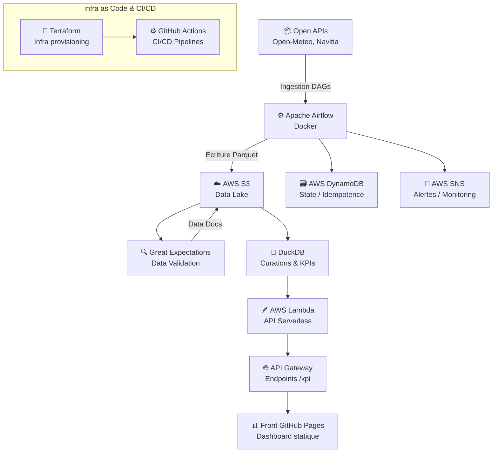

# 🌦️ DataOps Urban Mobility & Weather Insights Platform

[](https://www.terraform.io/)
[](https://github.com/features/actions)
[](https://aws.amazon.com/)
[](https://airflow.apache.org/)
[](https://greatexpectations.io/)
[](https://duckdb.org/)
[](https://opensource.org/licenses/MIT)

> **Projet Data Engineering complet (end-to-end)** démontrant la mise en œuvre d’une plateforme DataOps corrélant **les données météorologiques** et **la ponctualité des transports urbains**, avec une architecture 100% **Cloud AWS**.

---

## 🎯 Objectif & Enjeux du Projet

Cette plateforme illustre la conception d’une architecture **modulaire, observable et automatisée** permettant de :
- Collecter et historiser les données météo + transport.
- Garantir la **qualité, traçabilité et fiabilité** des données.
- Exposer des **indicateurs de performance (KPIs)** via une API serverless.
- Démontrer une **expertise complète en Data Engineering et DataOps**.

---

## Stack Technique

| Domaine | Technologie | Rôle |
|----------|--------------|------|
| 🧩 **Infrastructure as Code** | Terraform | Provisionnement des ressources AWS |
| ☁️ **Cloud Provider** | AWS (S3, Lambda, SNS, DynamoDB, IAM) | Hébergement et orchestration serverless |
| ⚙️ **Orchestration** | Apache Airflow (Docker Compose) | Ingestion automatisée et scheduling |
| 🧪 **Data Quality** | Great Expectations | Validation et génération de Data Docs |
| 🦆 **Query Engine** | DuckDB | Curations et agrégations locales sur S3 |
| 🧱 **Storage** | S3 (Data Lake) + DynamoDB | Sauvegarde et suivi d’état |
| 🔔 **Monitoring / Alerting** | SNS + EmailJS | Notifications automatiques |
| 🧰 **CI/CD** | GitHub Actions | Déploiement automatique de l’infra et du code |
| 💻 **Front-end** | GitHub Pages + Chart.js | Visualisation des KPIs |

---

## 🧱 Architecture Technique (vue d’ensemble)



## Étapes de la Pipeline
#### 1️⃣ Ingestion des données

Sources :

  - Open-Meteo API (conditions météo)

  - Navitia API (ponctualité transport)

  - Orchestration : Airflow

  - Stockage : fichiers Parquet → s3://umwi-data-dev/raw/

#### 2️⃣ Validation & Qualité des données

- Framework : Great Expectations

- Génération automatique des rapports dans S3

- Alertes en cas d’échec : SNS → Email

#### 3️⃣ Curations et Indicateurs

DuckDB pour jointures et calculs de KPIs

Trois niveaux de data :

  - 🥉 Bronze → brut

  - 🥈 Silver → nettoyé

  - 🥇 Gold → indicateurs (corrélation pluie ↔ retards)

#### 4️⃣ API Serverless

- AWS Lambda (FastAPI + Mangum)

- API Gateway → expose /kpi & /correlation

- DynamoDB : stockage des états et cache.

#### 5️⃣ Visualisation

- Dashboard hébergé sur GitHub Pages

- Chart.js / JS fetch API consommant l’API Lambda

- Envoi d’alertes via EmailJS.

## Infrastructure as Code

L’infrastructure est déployée automatiquement via Terraform :

S3 Bucket : ( umwi-data-dev) Data Lake (brut, silver, gold)


DynamoDB Table : ( umwi-ingestion-dev )	Table d’état / idempotence


SNS Topic	: (umwi-alerts-dev)	Alertes par e-mail


IAM Role : 	( umwi-lambda-exec-dev )	Permissions pour Lambda


CI/CD	: s	Automatisation de l’infra et du code

## Structure du Projet

```bash
Dataops-urban-mobility/
│
├── infra/
│   └── terraform/
│       └── envs/dev/
│           ├── providers.tf
│           ├── variables.tf
│           ├── terraform.tfvars
│           ├── s3.tf
│           ├── dynamodb.tf
│           ├── sns.tf
│           ├── iam-lambda.tf
│           ├── outputs.tf
│
├── airflow/
│   ├── dags/
│   ├── docker-compose.yaml
│   └── requirements.txt
│
├── ge/
│   └── expectations/
│
├── lambda_api/
│   └── handler.py
│
├── front/
│   └── index.html
│
└── .github/workflows/
    ├── infra-deploy.yml
    ├── build-test.yml
    └── front-deploy.yml
```

## Résultats & Impacts

✅ Corrélation quantifiée entre météo et performance transport

✅ Détection automatique des anomalies (via GE + SNS)

✅ Infra serverless et scalable, sans maintenance manuelle

✅ Coût zéro (Free-tier AWS + GitHub Pages)

✅ Réutilisable pour tout projet DataOps / Smart City

🧑‍💻 Auteur & Contact

- Me
- LinkedIn :  https://www.linkedin.com/in/houssem-rezgui-/

## Stack Icons
<p align="center">  </p>


“Building reliable, observable and scalable data systems — one DAG at a time.”